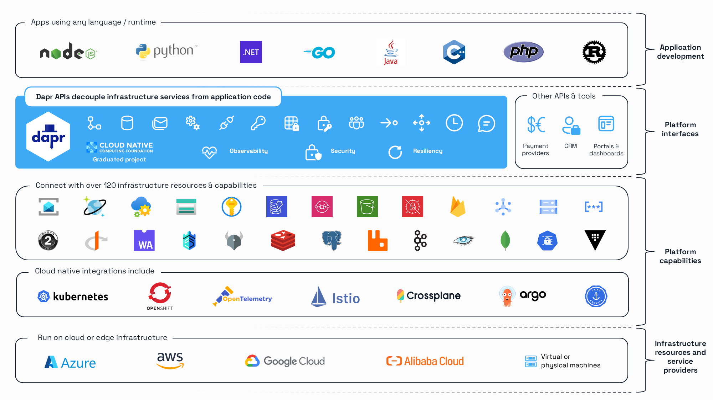

<h2>Building Performant, Secure and Reliable Distributed System</h2>

[![Docker Pulls][docker-badge]][docker-url] [![Build Status][actions-badge]][actions-url] [![Test Status][e2e-badge]][e2e-url] [![Code Coverage][codecov-badge]][codecov-url] [![License: Apache 2.0][apache-badge]][apache-url] [![FOSSA Status][fossa-badge]][fossa-url] [![TODOs][todo-badge]][todo-url] [![Good First Issues][gfi-badge]][gfi-url] [![discord][discord-badge]][discord-url] [![YouTube][youtube-badge]][youtube-link] [![Bluesky][bluesky-badge]][bluesky-link] [![X/Twitter][x-badge]][x-link]

[docker-badge]: https://img.shields.io/docker/pulls/daprio/raprd?style=flat&logo=docker
[docker-url]: https://hub.docker.com/r/takulatech/rapr
[apache-badge]: https://img.shields.io/github/license/dapr/dapr?style=flat&label=License&logo=github
[apache-url]: https://github.com/takula-tech/rapr/blob/master/LICENSE
[actions-badge]: https://github.com/takula-tech/rapr/workflows/dapr/badge.svg?event=push&branch=master
[actions-url]: https://github.com/takula-tech/rapr/actions?workflow=dapr
[e2e-badge]: https://img.shields.io/endpoint?url=https://gist.githubusercontent.com/rapr-bot/14e974e8fd6c6eab03a2475beb1d547a/raw/rapr-test-badge.json
[e2e-url]: https://github.com/takula-tech/rapr/actions?workflow=rapr-test&event=schedule
[codecov-badge]: https://codecov.io/gh/takula-tech/rapr/branch/master/graph/badge.svg
[codecov-url]: https://codecov.io/gh/takula-tech/rapr
[fossa-badge]: https://app.fossa.com/api/projects/custom%2B162%2Fgithub.com%2Ftakula-tech%2Frapr.svg?type=shield
[fossa-url]: https://app.fossa.com/projects/custom%2B162%2Fgithub.com%2Ftakula-tech%2Frapr?ref=badge_shield
[todo-badge]: https://badgen.net/https/api.tickgit.com/badgen/takula-tech/rapr
[todo-url]: https://www.tickgit.com/browse?repo=github.com/takula-tech/rapr
[gfi-badge]:https://img.shields.io/github/issues-search/takula-tech/rapr?query=type%3Aissue%20is%3Aopen%20label%3A%22good%20first%20issue%22&label=Good%20first%20issues&style=flat&logo=github
[gfi-url]:https://github.com/takula-tech/rapr/issues?q=is%3Aissue+is%3Aopen+label%3A%22good+first+issue%22
[discord-badge]: https://img.shields.io/discord/1335036405788971020.svg?label=&logo=discord&logoColor=ffffff&color=7389D8
[discord-url]: https://discord.gg/3jq8js8u
[youtube-badge]:https://img.shields.io/youtube/channel/views/xxx?style=flat&label=YouTube%20views&logo=youtube
[youtube-link]:https://youtube.com/@takulatechdev
[bluesky-badge]:https://img.shields.io/badge/Follow-%40takulatechdev.bsky.social-0056A1?logo=bluesky
[bluesky-link]:https://bsky.app/profile/takulatechdev.bsky.social
[x-badge]:https://img.shields.io/twitter/follow/takulatechdev?logo=x&style=flat
[x-link]:https://twitter.com/takulatechdev

Rapr is a set of integrated APIs with built-in best practices and patterns to build distributed applications. Rapr increases your developer productivity by 20-40% with out-of-the-box features such as workflow, pub/sub, state management, secret stores, external configuration, bindings, actors, distributed lock, and cryptography. You benefit from the built-in security, reliability, and observability capabilities, so you don't need to write boilerplate code to achieve production-ready applications.

With Rapr, platform teams can configure complex setups while exposing simple interfaces to application development teams, making it easier for them to build highly scalable distributed applications. Many platform teams have adopted Rapr to provide governance and golden paths for API-based infrastructure interaction.

## Goals

- Enable developers using *any* language or framework to write distributed applications
- Solve the hard problems developers face building microservice applications by providing best practice building blocks
- Be community driven, open and vendor neutral
- Gain new contributors
- Provide consistency and portability through open APIs
- Be platform agnostic across cloud and edge
- Embrace extensibility and provide pluggable components without vendor lock-in
- Enable IoT and edge scenarios by being highly performant and lightweight
- Be incrementally adoptable from existing code, with no runtime dependency

## How it works

Rapr injects a side-car (container or process) to each compute unit. The side-car interacts with event triggers and communicates with the compute unit via standard HTTP or gRPC protocols. This enables Rapr to support all existing and future programming languages without requiring you to import frameworks or libraries.

Rapr offers built-in state management, reliable messaging (at least once delivery), triggers and bindings through standard HTTP verbs or gRPC interfaces. This allows you to write stateless, stateful and actor-like services following the same programming paradigm. You can freely choose consistency model, threading model and message delivery patterns.

Rapr runs natively on Kubernetes, as a self hosted binary on your machine, on an IoT device, or as a container that can be injected into any system, in the cloud or on-premises.

Rapr uses pluggable component state stores and message buses such as Redis as well as gRPC to offer a wide range of communication methods, including direct dapr-to-dapr using gRPC and async Pub-Sub with guaranteed delivery and at-least-once semantics.

## Why Rapr?

Writing highly performant, scalable and reliable distributed application is hard. Rapr brings proven patterns and practices to you. It unifies event-driven and actors semantics into a simple, consistent programming model. It supports all programming languages without framework lock-in. You are not exposed to low-level primitives such as threading, concurrency control, partitioning and scaling. Instead, you can write your code by implementing a simple web server using familiar web frameworks of your choice.

Rapr is flexible in threading and state consistency models. You can leverage multi-threading if you choose to, and you can choose among different consistency models. This flexibility enables you to implement advanced scenarios without artificial constraints. Rapr is unique because you can transition seamlessly between platforms and underlying implementations without rewriting your code.

## Features

- Event-driven Pub-Sub system with pluggable providers and at-least-once semantics
- Input and output bindings with pluggable providers
- State management with pluggable data stores
- Consistent service-to-service discovery and invocation
- Opt-in stateful models: Strong/Eventual consistency, First-write/Last-write wins
- Cross platform virtual actors
- Secret management to retrieve secrets from secure key vaults
- Rate limiting
- Built-in [Observability](https://rapr-docs.takulatech.net/concepts/observability-concept/) support
- Runs natively on Kubernetes using a dedicated Operator and CRDs
- Supports all programming languages via HTTP and gRPC
- Multi-Cloud, open components (bindings, pub-sub, state) from Azure, AWS, GCP
- Runs anywhere, as a process or containerized
- Lightweight (58MB binary, 4MB physical memory)
- Runs as a sidecar - removes the need for special SDKs or libraries
- Dedicated CLI - developer friendly experience with easy debugging
- Clients for Java, .NET Core, Go, Javascript, Python, Rust and C++

## Get Started using Rapr

See our [Getting Started](https://rapr-docs.takulatech.net/getting-started/) guide over in our docs.

## Quickstarts and Samples

- See the [quickstarts repository](https://github.com/takula-tech/rapr/quickstarts) for code examples that can help you get started with Rapr.
- Explore additional samples in the Rapr [samples repository](https://github.com/takula-tech/rapr/samples).

## Community

We want your contributions and suggestions! One of the easiest ways to contribute is to participate in discussions on the mailing list, chat on IM or the bi-weekly community calls.
For more information on the community engagement, developer and contributing guidelines and more, head over to the [Rapr community repo](https://github.com/takula-tech/rapr/community#dapr-community).

### Contact Us

Reach out with any questions you may have and we'll make sure to answer them as soon as possible!

| Platform              | Link                                                                                                                          |
| :-------------------- | :---------------------------------------------------------------------------------------------------------------------------- |
| 💬 Discord (preferred) |  |
| 💭 LinkedIn            | [@takulatech](https://www.linkedin.com/company/takula-technology/)                                                            |
| 🦋 BlueSky             | [@takulatechdev.bsky.social](https://bsky.app/profile/takulatechdev.bsky.social)                                              |
| 🐤 Twitter             | [@takulatechdev](https://twitter.com/takulatechdev)                                                                           |

### Contributing to Rapr

See the [Development Guide](https://rapr-docs.takulatech.net/contributing/) to get started with building and developing.

## Repositories

| Repo                                                                         | Description                                                                                                                                                  |
| :--------------------------------------------------------------------------- | :----------------------------------------------------------------------------------------------------------------------------------------------------------- |
| [Rapr](https://github.com/takula-tech/rapr)                                  | The main repository that you are currently in. Contains the Rapr runtime code and overview documentation.                                                    |
| [CLI](https://github.com/takula-tech/rapr/cli)                               | The Rapr CLI allows you to setup Rapr on your local dev machine or on a Kubernetes cluster, provides debugging support, launches and manages Rapr instances. |
| [Docs](https://rapr-docs.takulatech.net)                                     | The documentation for Rapr.                                                                                                                                  |
| [Quickstarts](https://github.com/takula-tech/rapr/quickstarts)               | This repository contains a series of simple code samples that highlight the main Rapr capabilities.                                                          |
| [Samples](https://github.com/takula-tech/rapr/samples)                       | This repository holds community maintained samples for various Rapr use cases.                                                                               |
| [Components-contrib](https://github.com/takula-tech/rapr/components-contrib) | The purpose of components contrib is to provide open, community driven reusable components for building distributed applications.                            |
| [Dashboard](https://github.com/takula-tech/rapr/dashboard)                   | General purpose dashboard for Rapr                                                                                                                           |
| [Go-sdk](https://github.com/takula-tech/rapr-go-sdk)                         | Rapr SDK for Go                                                                                                                                              |
| [Java-sdk](https://github.com/takula-tech/rapr-java-sdk)                     | Rapr SDK for Java                                                                                                                                            |
| [JS-sdk](https://github.com/takula-tech/rapr-js-sdk)                         | Rapr SDK for JavaScript                                                                                                                                      |
| [Python-sdk](https://github.com/takula-tech/rapr-python-sdk)                 | Rapr SDK for Python                                                                                                                                          |
| [Dotnet-sdk](https://github.com/takula-tech/rapr-dotnet-sdk)                 | Rapr SDK for .NET                                                                                                                                            |
| [Rust-sdk](https://github.com/takula-tech/rapr-rust-sdk)                     | Rapr SDK for Rust                                                                                                                                            |

## Code of Conduct

Please refer to our [Rapr Community Code of Conduct](https://github.com/takula-tech/rapr/community/blob/master/CODE-OF-CONDUCT.md)
